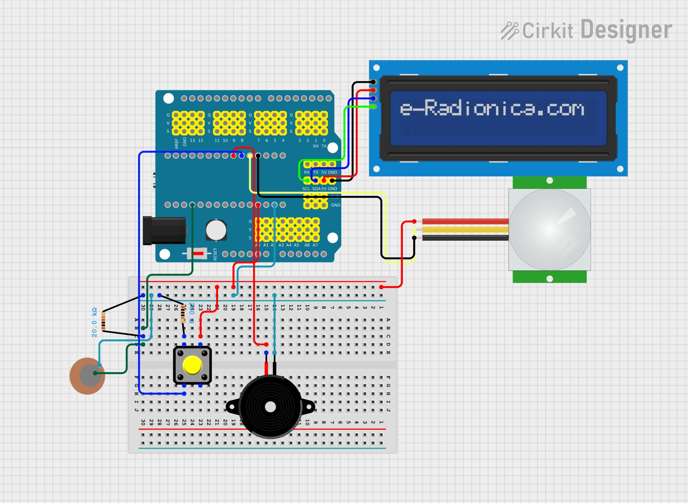
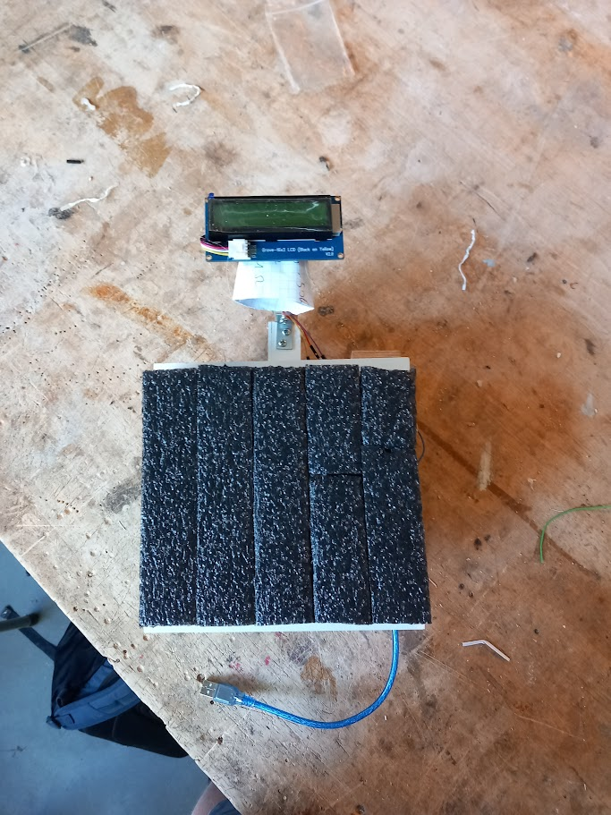
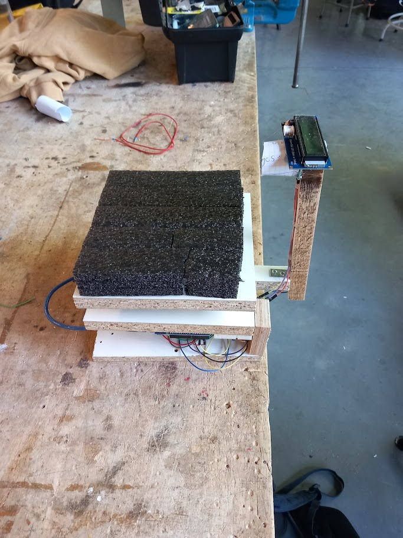

# Arduino remake of the power cube 
 
Dit project is gebaseerd op PowerKube, maar staat volledig los van PowerKube.

## Inleiding

Voor het vak *Opkomende Technologieën* is een boksmachine gemaakt die de **snelheid** en de **kracht** van een vuistslag meet. Het project maakt gebruik van sensoren en een Arduino om gegevens te verzamelen en weer te geven.

## Doel

Het doel van het project is het bouwen van een boksmachine die twee zaken meet:

-Hoe snel een vuist beweegt richting het stootkussen

-Hoe hard de vuist tegen het stootkussen slaat

## Gebruikte materialen

-Arduino Uno

-Infraroodsensor (voor snelheidsmeting)

-Drukknop (voor snelheidsmeting)

-Piezosensor (voor krachtmeting)

-LCD-scherm (voor scorebord)

-Stootkussen

-Breadboard en bedrading

## Werking

### Snelheid meten
De IR-sensor wordt gericht met behulp van een paperen kokervorm. Zo ziet de sensor enkel wat recht voor hem beweegt. Wanneer een vuist voorbij de sensor gaat, start een timer. Zodra de drukknop, die achter het stootkussen is geplaatst, geraakt wordt, stopt de timer. Het verschil in tijd tussen die twee momenten en de afstand tussen de sensor en de drukknop worden gebruikt om de snelheid van de vuistslag te bepalen.

### Kracht meten
Achter het stootkussen zit, naast de drukknop om de snelheid te meten, ook het piezo element. Dit fungeert als sensor en geeft een spanningssignaal wanneer hij wordt geraakt. Hoe harder de stoot, hoe hoger het signaal. De Arduino leest deze waarde uit en zet het zo om in een getal dat iets zegt over de kracht van de slag.

### Scorebord
Op een LCD-scherm worden de resultaten getoond. Hierop staan de snelheid (in km/u) en de kracht (als numerieke waarde). Zo is het mogelijk om elke slag direct te beoordelen. Wanneer de machine terug gereed is, luid er een buzzer die duidelijk maakt wanneer er nterug geslaan mag worden.

## Resultaat

## Mogelijke verbeteringen
- betere impactmeting met behulp van een druksensor in plaats van een piezo element
- robuustere en duurzamere bouw van het prototype ivm het stootkussen

